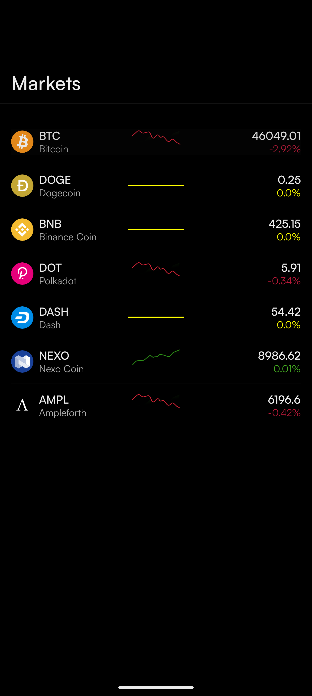

# 📈 CryptoPulseSocket (Real-Time WebSocket + Clean Architecture +MVI + Hilt + Type-Safe Navigation)

CryptoApp is a modern Android application built with Kotlin, designed to deliver **real-time cryptocurrency market data**, including price updates, historical price charts, and detailed coin information. 

**Real-time WebSocket Streaming:** The app leverages WebSocket (Socket.IO) to provide **instant price updates** and detailed coin information as it happens, ensuring the UI is always reactive and up-to-date.

It uses **MVI (Model-View-Intent)** architecture, **Clean Architecture**, Kotlin Coroutines, Jetpack Compose, and **type-safe navigation** using Jetpack Navigation for robust and safe screen transitions.
---

## 📸 Screenshots & Demo

| Home Page | Detail Page |
|-----------|-------------|
|  |  |
---

## 📱 Key Screens & Features

### Home Page
- Displays a list of cryptocurrencies with:
  - Real-time price updates via WebSocket
  - Percentage change indicators with dynamic icons (up, down, stable)
  - Clickable items to navigate to the detail page using type-safe navigation
  - Responsive UI built with Jetpack Compose

### Detail Page
- Shows detailed information for a selected cryptocurrency:
  - Real-time price and percentage change
  - Interactive line chart for historical price data with manual and auto-scroll modes
  - Historical price list in reverse chronological order
  - Type-safe navigation back to the home page

---

## 🧠 Technologies Used

| Technology | Purpose |
|------------|---------|
| Kotlin | Core programming language |
| Kotlin Coroutines | Asynchronous operations and concurrency |
| MVI | Architecture pattern for predictable state management |
| Clean Architecture | Separation of concerns (UI, Domain, Data) |
| SOLID Principles | Scalable and maintainable codebase |
| Jetpack Compose | Modern UI toolkit |
| WebSocket (Socket.IO) | Real-time data streaming |
| Hilt | Dependency injection |
| StateFlow | Reactive state management |
| Jetpack Navigation | Type-safe navigation between screens |
| Gson | JSON parsing for WebSocket data |
| Material Design 3 | UI design system |

---

## ⚙️ Core Features

✅ **Real-time Updates:** Cryptocurrency price updates streamed via WebSocket (`cryptoUpdate`, `cryptoDetailUpdate`)  
✅ **Interactive Chart:** Price history chart with tap and drag gestures for manual and auto-scroll modes  
✅ **Type-Safe Navigation:** Jetpack Navigation with type-safe routes (`Routes.HomeScreen`, `Routes.DetailScreen`)  
✅ **Offline Support:** Default cryptocurrency list (BTC, DOGE, BNB, etc.) for offline use  
✅ **Dynamic Indicators:** Percentage change indicators (green for positive, red for negative, yellow for stable)  
✅ **Responsive UI:** Built with Jetpack Compose for a modern, declarative interface  
✅ **MVI Pattern:** Predictable state management using State, Event, and Navigation classes  
✅ **Dependency Injection:** Hilt for modular and testable code  
✅ **Navigation Safety:** Custom `safeNavigate` and `safePopBackStack` utilities  

---

## 🧱 Project Architecture

### 🧩 Clean Architecture (with Kotlin Coroutines)

#### 1. UI Layer (Presentation)
- **Screens**
  - `HomeScreen`: Displays a list of cryptocurrencies with real-time updates  
  - `DetailScreen`: Shows detailed coin data, including a price chart and history  

- **ViewModels**
  - `HomeViewModel`: Manages home screen state, subscribes to crypto list updates, handles navigation  
  - `DetailViewModel`: Manages detail screen state, subscribes to specific coin updates, controls chart interactions  

- **State Management**
  - Uses `StateFlow` for reactive UI updates (`HomeState`, `DetailState`)  
  - `HomeEvents` and `DetailEvents` handle user interactions  
  - Type-safe navigation using `HomeNavigation` and `DetailNavigation`  

- **Mappers**
  - Converts domain models to UI models (`toCryptoUiModel`)  

#### 2. Domain Layer
- **Use Cases**
  - `CryptoListUpdatesUseCase`: Fetches real-time updates for the crypto list  
  - `CryptoDetailUpdatesUseCase`: Fetches real-time updates for a specific coin  
  - `GetCryptosUseCase`: Retrieves the default cryptocurrency list  
  - `SubscribeCryptoListUseCase` & `SubscribeDetailUseCase`: Subscribes to WebSocket events  
  - `MapUpdateToCryptoUseCase`: Maps WebSocket updates to domain models  

- **Pure Kotlin classes** with business logic  
- **Suspend functions** for coroutine-based operations  

#### 3. Data Layer
- **Repositories**
  - `CryptoRepositoryImpl`: Handles data operations and WebSocket communication  

- **SocketHandler**
  - Manages WebSocket connections and emits reactive flows to deliver real-time crypto updates.
  - Handles **list updates** (`cryptoUpdate`) and **detail updates** (`cryptoDetailUpdate`).
  - Supports subscriptions for specific coins or lists of coins.
  - Integrates with ViewModels for reactive UI updates.
  - Gracefully handles connection errors and malformed data.

- **Mappers**
  - Converts WebSocket data to domain models and then to UI models.  

- **Default Data**
  - Provides default cryptocurrencies for offline use.  

- **Models**
  - `CryptoModel`, `CryptoUpdate`, `PercentChange`  

---

## 🔁 Coroutine Flow
- **WebSocket:** Emits real-time updates as Kotlin Flows for list and detail updates.  
- **Repository:** Maps WebSocket updates to domain models.  
- **Use Cases:** Handle business logic with suspend functions and flows.  
- **ViewModels:** Collect flows and update UI state via `StateFlow`.  
- **Real-time Updates:** Seamlessly integrated into the UI.  

---

## 🛠 Local WebSocket Configuration (SocketModule)

CryptoApp allows you to connect to a **local WebSocket server** for real-time crypto updates. The integration is done using **Hilt** dependency injection.

### How It Works
- **SocketModule** is a Hilt module installed in the `SingletonComponent`.
- It provides a singleton `Socket` instance configured to connect to your **local server**.
- You can replace the local IP (`172.20.11.81:3000`) with your own server address.
- The module also provides a singleton `SocketHandler`, which is injected wherever needed.

This setup makes it easy to **test and debug crypto updates locally** without requiring a remote server connection.

---

## 🚀 Type-Safe Navigation
- **Jetpack Navigation:** Kotlin type-safe routing with `Routes`  
- **Navigation Utilities**
  - `safeNavigate`: Ensures safe navigation  
  - `safePopBackStack`: Lifecycle-aware back navigation  

- **Navigation Classes**
  - `HomeNavigation`: Navigation actions from home  
  - `DetailNavigation`: Navigation actions from detail screen  

- **NavHost**
  - `MainNavHost` and `CryptoNavGraph` configure navigation graph  
  - Lifecycle-aware collection using `LaunchedEffect` and `LocalLifecycleOwner`  

---

## 🚀 Getting Started

```bash
git clone https://github.com/AminAbbasov778/CryptoApp.git
